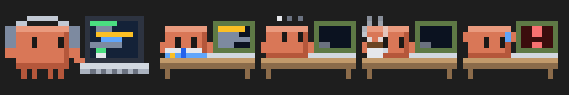
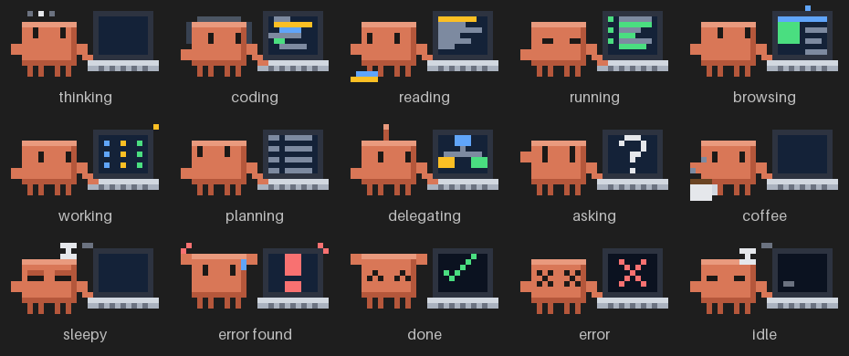
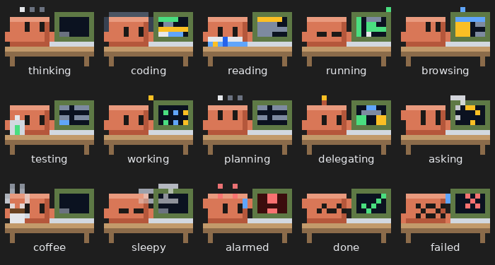

# tiny-pet

A Claude Code mod that puts a tiny pixel-art Claude pet, with its own little laptop, in a band above your prompt. A mod is a plugin made of function hooks, so it installs and uninstalls with the usual `/plugin` commands.

## Preview

The pet with a crew of four subagents (reading, planning, taking a coffee break, and reacting to an error):



The main pet in each of its personalities and states:



A subagent in each of its looks:



These images are drawn from the same pixel code the mod uses. The terminal shows them in true color with half-block characters, so they look the same up to the terminal's cell shape.

## Behavior

| State   | When                                  | What you see                                                                 |
| ------- | ------------------------------------- | ---------------------------------------------------------------------------- |
| Working | A turn is running                     | The pet acts out what it is doing, see Personalities below                   |
| Done    | A turn ended with an answer           | Arms up, happy eyes, a check mark on the screen                              |
| Error   | A turn ended with an error or refusal | Crossed eyes, a cross on the screen                                          |
| Idle    | Otherwise, and 5 seconds after Done   | The pet naps beside a dim laptop                                             |

An interrupted turn goes straight back to Idle.

### Personalities

While working, the main pet and every subagent act out what they are doing, judged from the tool in use. The caption (main pet) or label (subagent) names it.

| Personality | When                                                              | What you see                                                         |
| ----------- | ----------------------------------------------------------------- | -------------------------------------------------------------------- |
| thinking    | Between tool calls                                                | Eyes look up, thought dots above the head, a blinking cursor         |
| coding      | Edit, Write, MultiEdit, NotebookEdit                              | Headphones, hands typing, colored code scrolling                     |
| reading     | Read, Grep, Glob, LS                                              | Wide scanning eyes, holding an open book up to read, a highlight moving over text |
| running     | Bash                                                              | Squinting at a green terminal, a blinking status light               |
| browsing    | WebFetch, WebSearch                                               | A web page on screen, a wifi blip above the laptop                   |
| testing     | Playwright and Chrome DevTools MCP tools                          | A bubbling lab tube, a test checklist ticking and a progress bar     |
| planning    | TodoWrite, plan mode tools                                        | Eyes up and to the side, a checklist being ticked off                |
| delegating  | Task, Agent, SendMessage                                          | A blinking antenna, a tree of boxes passing work down                |
| asking      | AskUserQuestion                                                   | A raised hand and a blinking question mark                           |
| working     | Any other tool, including MCP tools                               | Blinking indicator lights on screen and a spark                      |
| coffee      | Quiet for 6 seconds, or a Bash command running over 12 seconds   | Sips a mug of coffee with steam while it waits                       |
| sleepy      | Quiet for 25 seconds                                              | Heavy eyelids, a dim screen and a floating Z                         |
| error found | A tool call returned an error, for 3 seconds                      | Arms up and a hop, a sweat drop, a flashing red warning on screen    |

### Subagent crew

Each running subagent appears as a smaller copy of the main pet, sitting at its own little desk with a laptop. The laptop lid is tinted by subagent type, and the label under it shows the type and its current personality. A finished subagent hops with a smile and a green check, a failed one shows crossed eyes, a sweat drop and a red X, and it leaves 3 seconds later. With no subagents running the row does not exist.

Too many subagents to show:

- Working subagents are shown first, then finished ones.
- At most 5 mini pets are drawn, fewer on narrow terminals or at larger sizes.
- The rest collapse into one summary tile, for example `+6 more`, `2 working`, `1 failed`.
- If the terminal is too narrow even for the tile, the row is skipped and the caption still reports how many helpers are working.
- The mod tracks at most 64 subagents at once.

The main caption shows how many helpers are working, and the pet says "Supervising" when only subagents are running.

Commands (the typeahead shows `/pet [small|medium|large|hide|show]`):

- `/pet`: hide or show the pet.
- `/pet hide` and `/pet show`: hide or show it explicitly.
- `/pet small`, `/pet medium`, `/pet large`: resize it, see Size below.

The band stays hidden only while the session has no input, so an empty session shows just the native welcome. The pet appears and starts working the moment you submit your first message. Slash commands do not count as input, and a resumed session shows it right away. It is also hidden while a survey is shown. It is drawn on the terminal and on the desktop Code tab. The terminal gets a true-color cell grid, the desktop gets an SVG of the same art.

## Size

The `size` option scales the whole pet, including the subagent crew:

| Value  | Scale | Main pet (columns x rows) |
| ------ | ----- | ------------------------- |
| small  | half  | 14 x 4                    |
| medium | 1x    | 27 x 7 (default)          |
| large  | 2x    | 54 x 14                   |

Every size scales width and height together, so the pet keeps its proportions. Small halves the art in both directions and keeps the eyes and other dark details visible. Large needs a wide and tall terminal, and fewer mini pets fit beside it. If the space above the prompt is too short for the chosen size, the pet steps down to the next size that fits instead of being cut off. On the desktop Code tab the SVG scales by the same factor.

Change it with `/pet small`, `/pet medium` or `/pet large`. It applies immediately, even in the middle of a turn, and is remembered across sessions.

The `size` option in the plugin's options screen (shown at install time and in the config menu) sets the default for when no size has been chosen with `/pet`. Once you run `/pet <size>`, that choice wins over the option.

## Install

In any Claude Code session:

```
/plugin install tiny-pet --marketplace cabrera-evil/claude-pet
```

Answer `y` to add the marketplace, then choose the user scope so the pet loads in every session. It is active right away, with no restart.

From a local clone instead:

```
git clone https://github.com/cabrera-evil/claude-pet
claude plugin marketplace add ./claude-pet
claude plugin install tiny-pet@claude-pet
```

To try it for one session without installing:

```
claude --plugin-dir /path/to/claude-pet
```

## Uninstall

```
claude plugin uninstall tiny-pet@claude-pet
claude plugin marketplace remove claude-pet
```

Or inside a session: run `/plugin`, select tiny-pet, then Uninstall.

## Update

For a marketplace added from a folder, edit the files and run `/reload-plugins`. For one added from GitHub, pull the new version with:

```
claude plugin update tiny-pet@claude-pet
```

## Troubleshooting

- The pet does not show: run `/plugin` and confirm tiny-pet is enabled, then `/reload-plugins`. Run `/pet` in case it was hidden.
- Colors look wrong: the terminal needs true-color support.
- Flicker on a slow terminal: raise `WORK_TICK_MS` and `IDLE_TICK_MS` in `hooks/register.tsx`.
- Inspect load problems with `claude --debug`.

## Development

Validate the manifest, marketplace and hooks module:

```
claude plugin validate .
```

Layout:

- `.claude-plugin/plugin.json`: mod manifest.
- `.claude-plugin/marketplace.json`: makes this repository installable as a marketplace.
- `hooks/hooks.json`: names the hooks module.
- `hooks/register.tsx`: events, state and the band drawing.
- `hooks/art/pixels.ts`: pixel canvas helpers and the shared color palette.
- `hooks/logic/activity.ts`: decides which personality applies from the tool in use, its timing and errors.
- `hooks/art/pet.ts`: the main pet and laptop art for every state and personality. Change colors and shapes here.
- `hooks/art/mini.ts`: the mini subagent pets, their desks and per-personality art.
- `docs/`: the preview images used by this README.
- `hooks/logic/crew.ts`: the logic that fits the crew into the available width.
- `hooks/render/render.ts`: converts the pixels to a terminal cell grid (half-block characters, scaled up or down) or an SVG.
- `types/index.d.ts`: the state contract the module is validated against.

## License

See `LICENSE`.
